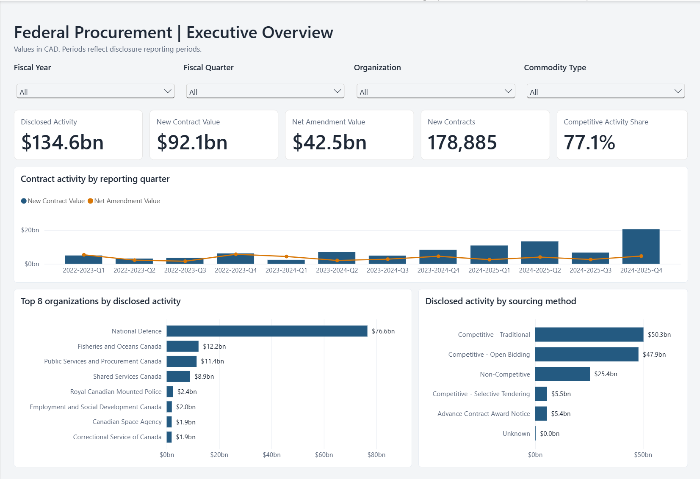

# Federal Procurement Analytics

**An interactive Power BI report exploring Canadian federal contract disclosures for fiscal years 2022–2023 through 2024–2025.**

[Download the Power BI report](Federal_Procurement_Analytics.pbix)

## Overview

This project turns publicly available procurement records into an executive overview of contract activity. It brings together data preparation, a star-schema model, DAX measures, and an interactive report to explore how disclosed values vary across reporting periods, government organizations, and sourcing methods.

The dashboard helps answer:

- How much disclosed activity comes from new contracts versus amendments?
- How does activity change across fiscal years and quarters?
- Which organizations account for the largest disclosed values?
- How is activity distributed across sourcing methods?
- What share of disclosed activity is classified as competitive?

## Dashboard features

- **Four slicers:** fiscal year, fiscal quarter, organization, and commodity type.
- **Five summary cards:** disclosed activity, new contract value, net amendment value, new contracts, and competitive activity share.
- **Quarterly comparison:** columns for new contract value and a line for net amendment value.
- **Organization ranking:** the top eight organizations by disclosed activity within the current filter selection.
- **Sourcing breakdown:** disclosed activity by sourcing method.

Selections update the relevant visuals so users can move from the overall picture to a specific reporting period or organization.

## Project snapshot

Across the full project dataset, before slicer selections:

| Metric | Value |
| --- | ---: |
| Disclosed activity | CAD 134.6 billion |
| New contract value | CAD 92.1 billion |
| Net amendment value | CAD 42.5 billion |
| New contract records | 178,885 |
| Competitive activity share | 77.1% |

These figures describe the data snapshot used for this project, not a live feed. A filtered screenshot may display different totals.

## Tools and approach

**Power BI Desktop · Power Query · DAX · Dimensional modelling**

### Data preparation

Prepared CSV tables were loaded into Power BI, with data types set for dates, identifiers, and financial values. A separate English organization-name column provides shorter chart labels while retaining the original bilingual names.

New contract values and signed amendment values are represented separately so their contributions can be compared without summing cumulative reported contract totals indiscriminately.

### Data model

The model uses a central fact table and four dimension tables:

| Table | Purpose |
| --- | --- |
| `FactContracts` | Disclosure records, reporting periods, activity values, and sourcing attributes |
| `DimOrganization` | Organization identifiers and names |
| `DimVendor` | Vendor identifiers and descriptive information |
| `DimCategory` | Commodity classifications |
| `DimDate` | Calendar attributes related to the contract date |

Each dimension has an active, one-to-many relationship to `FactContracts`, with filtering from the dimension to the fact table.

**The Executive overview uses reporting-period fields from `FactContracts`.** These describe when activity was disclosed. The contract-date calendar serves a different purpose: a recently reported amendment can relate to a contract awarded years earlier.

### Measures

| Measure | Definition |
| --- | --- |
| Disclosed Activity | New contract value plus signed amendment value; standing-offer records contribute zero under the project's activity definition |
| New Contract Value | Sum of the prepared new-contract value field |
| Net Amendment Value | Sum of signed amendment values; reductions offset increases |
| New Contracts | Count of disclosure rows classified as `Contract`, rather than a distinct count of procurement IDs |
| Competitive Activity Share | Disclosed activity flagged as competitive divided by total disclosed activity |

Competitive share is **value-based**, not the percentage of contract records awarded competitively.

## View the report

## Explore the interactive report

1. Download `Federal_Procurement_Analytics.pbix` using GitHub's download option.
2. Open it in a current version of Power BI Desktop on Windows.
3. Use the slicers to select reporting periods, organizations, or commodity types.
4. Clear selections to return to the full dataset.

GitHub displays the project documentation and preview; the interactive report runs in Power BI Desktop. The saved PBIX contains imported data and can normally be explored without refreshing.

## Data source and interpretation

Source: Government of Canada, [Proactive Publication – Contracts](https://open.canada.ca/data/en/dataset/d8f85d91-7dec-4fd1-8055-483b77225d8b), published through the Open Government Portal.

The project covers reporting fiscal years **2022–2023 to 2024–2025**. Monetary values are presented in **Canadian dollars**.

- Disclosed contract values and amendments do **not** represent cash payments or actual expenditure during the reporting period.
- Records may be revised, incomplete, or inconsistent. The source is unaudited.
- Large contracts and amendments can strongly influence quarterly totals and organization rankings.
- Sourcing classifications alone do not establish procurement quality, compliance, or value for money.
- The report is an independent portfolio project and is not an official Government of Canada publication.

## Author

**Matthew Pronyshyn**  
[GitHub](https://github.com/MattPronyshyn)
